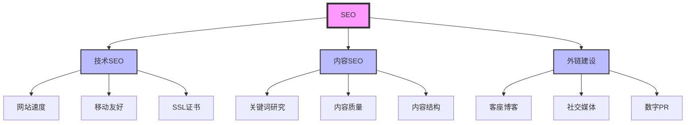
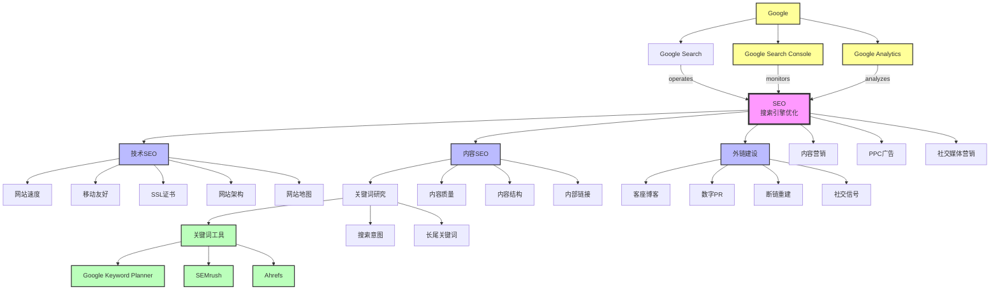

# 实体关系构建模板

## 模板概述

本模板提供构建清晰实体关系的方法，帮助 AI 搜索引擎更好地理解内容中的概念和它们之间的关系。

---

## 核心概念

### 什么是实体？

**实体（Entity）** 是现实世界中可以明确定义的对象、概念、事件或事物，如：
- **人物（Person）**：作者、专家、名人
- **组织（Organization）**：公司、机构、团体
- **概念（Concept）**：专业术语、方法、技术
- **地点（Place）**：城市、国家、地区
- **事件（Event）**：会议、发布、更新

### 什么是实体关系？

**实体关系** 描述实体之间的语义关联，如：
- **is-a**（是）：SEO 是一种营销策略
- **part-of**（组成部分）：关键词研究是 SEO 的一部分
- **related-to**（相关）：SEO 与内容营销相关
- **impacts**（影响）：技术 SEO 影响网站速度

---

## 实体识别

### 1. 核心实体识别

**步骤：**
1. 列出文章中的所有重要概念
2. 识别每个实体的类型
3. 确定实体间的关联
4. 构建实体层次结构

**示例：**
```markdown
### 文章主题：SEO 完全指南

**识别的实体：**

#### 核心实体（SEO）
- **类型：** Concept（概念）
- **定义：** 搜索引擎优化
- **同义词：** Search Engine Optimization, 搜索优化
- **属性：** 技术、内容、外链

#### 子概念实体
1. **技术 SEO**
   - **类型：** Concept
   - **关系：** part-of → SEO
   - **属性：** 速度、移动友好、架构

2. **内容 SEO**
   - **类型：** Concept
   - **关系：** part-of → SEO
   - **属性：** 关键词、质量、结构

3. **外链建设**
   - **类型：** Concept
   - **关系：** part-of → SEO
   - **属性：** 质量、相关性、权威性

#### 相关实体
1. **关键词研究**
   - **类型：** Concept
   - **关系：** used-in → 内容 SEO
   - **关系：** impacts → SEO 效果

2. **Google**
   - **类型：** Organization
   - **关系：** operates → Google Search
   - **关系：** provides → Google Search Console

3. **搜索引擎**
   - **类型：** Concept
   - **关系：** broader-than → SEO
   - **包含：** Google、Bing、Baidu
```

### 2. 实体分类框架

**人物实体（Person）**
```markdown
#### 模板
- **姓名：** [全名]
- **类型：** Person
- **角色/职位：** [职位名称]
- **所属组织：** [公司/机构]
- **资质/证书：** [专业认证]
- **贡献：** [在主题领域的贡献]
- **相关链接：** [LinkedIn, Twitter, 个人网站]

#### 示例
- **姓名：** Rand Fishkin
- **类型：** Person
- **角色：** SEO 专家、企业家
- **所属组织：** Moz（创始人）、SparkToro（CEO）
- **资质：** 著名 SEO 思想领袖
- **贡献：** 提出 SEO 行业标准，创办 Moz
- **相关链接：** [LinkedIn](https://linkedin.com/in/randfishkin), [Twitter](https://twitter.com/randfish)
```

**组织实体（Organization）**
```markdown
#### 模板
- **名称：** [组织全名]
- **类型：** Organization
- **行业：** [所属行业]
- **主要产品/服务：** [产品列表]
- **成立时间：** [年份]
- **总部：** [城市, 国家]
- **相关实体：** [竞争对手、合作伙伴]

#### 示例
- **名称：** Google
- **类型：** Organization / Technology Company
- **行业：** 互联网、搜索引擎、广告
- **主要产品：** Google Search, Google Ads, Google Analytics, Google Search Console
- **成立时间：** 1998
- **总部：** Mountain View, California, USA
- **相关实体：** Microsoft（竞争）、Apple（竞争/合作）
```

**概念实体（Concept）**
```markdown
#### 模板
- **名称：** [概念名称]
- **类型：** Concept
- **定义：** [清晰定义]
- **同义词：** [其他称呼]
- **核心属性：** [关键特征]
- **父概念：** [所属更广泛的概念]
- **子概念：** [包含的具体概念]
- **相关概念：** [关联概念]
- **应用场景：** [使用场景]

#### 示例
- **名称：** SEO
- **类型：** Concept
- **定义：** 通过优化网站提高搜索引擎排名的过程
- **同义词：** Search Engine Optimization, 搜索引擎优化
- **核心属性：** 技术、内容、外链
- **父概念：** Digital Marketing（数字营销）
- **子概念：** 技术 SEO、内容 SEO、外链建设
- **相关概念：** Content Marketing（内容营销）, PPC（点击付费广告）
- **应用场景：** 网站流量增长、品牌知名度提升
```

---

## 实体关系类型

### 1. 层次关系（Hierarchical）

**is-a（是/属于）**
```markdown
SEO **is-a** 营销策略
关键词研究 **is-a** SEO 的一部分
```

**part-of（组成部分）**
```markdown
技术 SEO **part-of** SEO
关键词研究 **part-of** 内容 SEO
```

**has-part（包含）**
```markdown
SEO **has-part** 技术 SEO
SEO **has-part** 内容 SEO
SEO **has-part** 外链建设
```

### 2. 关联关系（Associative）

**related-to（相关）**
```markdown
SEO **related-to** 内容营销
SEO **related-to** 用户体验
SEO **related-to** 网站设计
```

**uses（使用）**
```markdown
SEO **uses** 关键词研究工具
SEO **uses** Google Search Console
SEO **uses** 分析工具
```

**enables（使能）**
```markdown
技术 SEO **enables** 搜索引擎抓取
高质量内容 **enables** 用户参与
```

### 3. 因果关系（Causal）

**impacts（影响）**
```markdown
网站速度 **impacts** 用户体验
外链质量 **impacts** 排名
内容质量 **impacts** 跳出率
```

**requires（需要）**
```markdown
SEO **requires** 持续优化
内容 SEO **requires** 关键词研究
外链建设 **requires** 高质量内容
```

**results-in（导致）**
```markdown
SEO 优化 **results-in** 有机流量增长
好的用户体验 **results-in** 更高转化率
```

### 4. 时空关系（Spatiotemporal）

**located-in（位于）**
```markdown
Google 总部 **located-in** Mountain View
Moz 总部 **located-in** Seattle
```

**created-at（创建于）**
```markdown
SEO 概念 **created-at** 1990 年代初
Google **created-at** 1998
```

**updated-at（更新于）**
```markdown
SEO 算法 **updated-at** 2024 年
内容 **updated-at** 2024-01-15
```

---

## 知识图谱构建

### 1. Mermaid 图表语法

**基础语法：**


### 2. 节点样式规范

**核心概念节点：**
```mermaid
style A fill:#f9f,stroke:#333,stroke-width:4px
```
- 填充色：`#f9f`（浅粉色）
- 边框色：`#333`（深灰色）
- 边框宽度：`4px`

**子概念节点：**
```mermaid
style B fill:#bbf,stroke:#333,stroke-width:2px
```
- 填充色：`#bbf`（浅蓝色）
- 边框色：`#333`（深灰色）
- 边框宽度：`2px`

**工具/资源节点：**
```mermaid
style N fill:#bfb,stroke:#333,stroke-width:2px
```
- 填充色：`#bfb`（浅绿色）
- 边框色：`#333`（深灰色）
- 边框宽度：`2px`

**组织/人物节点：**
```mermaid
style O fill:#ff9,stroke:#333,stroke-width:2px
```
- 填充色：`#ff9`（浅橙色）
- 边框色：`#333`（深灰色）
- 边框宽度：`2px`

### 3. 完整知识图谱示例

**SEO 知识图谱：**


---

## Schema.org 标记

### 1. 基础实体标记

**Thing（通用实体）**
```json
{
  "@context": "https://schema.org",
  "@type": "Thing",
  "name": "SEO",
  "description": "搜索引擎优化",
  "sameAs": [
    "https://en.wikipedia.org/wiki/Search_engine_optimization"
  ]
}
```

**Concept（概念）**
```json
{
  "@context": "https://schema.org",
  "@type": "Concept",
  "name": "SEO",
  "description": "通过优化网站提高搜索引擎排名的过程",
  "sameAs": ["https://en.wikipedia.org/wiki/Search_engine_optimization"],
  "relatedTo": [
    {
      "@type": "Concept",
      "name": "内容营销"
    },
    {
      "@type": "Concept",
      "name": "PPC广告"
    }
  ]
}
```

**DefinedTerm（定义术语）**
```json
{
  "@context": "https://schema.org",
  "@type": "DefinedTerm",
  "termIdentifier": "seo",
  "name": "SEO",
  "description": "搜索引擎优化（Search Engine Optimization）的缩写",
  "inDefinedTermSet": {
    "@type": "DefinedTermSet",
    "name": "数字营销术语",
    "hasPart": [
      {
        "@type": "DefinedTerm",
        "name": "PPC"
      },
      {
        "@type": "DefinedTerm",
        "name": "内容营销"
      }
    ]
  }
}
```

### 2. 人物和组织标记

**Person（人物）**
```json
{
  "@context": "https://schema.org",
  "@type": "Person",
  "name": "张三",
  "jobTitle": "高级 SEO 专家",
  "worksFor": {
    "@type": "Organization",
    "name": "Your Company"
  },
  "credential": "Google 认证 SEO 专家",
  "knowsAbout": ["SEO", "内容营销", "数据分析"],
  "sameAs": [
    "https://linkedin.com/in/zhangsan",
    "https://twitter.com/zhangsan"
  ]
}
```

**Organization（组织）**
```json
{
  "@context": "https://schema.org",
  "@type": "Organization",
  "name": "Google",
  "url": "https://about.google",
  "logo": "https://google.com/logo.png",
  "foundingDate": "1998",
  "founders": [
    {
      "@type": "Person",
      "name": "Larry Page"
    },
    {
      "@type": "Person",
      "name": "Sergey Brin"
    }
  ],
  "sameAs": [
    "https://en.wikipedia.org/wiki/Google"
  ]
}
```

### 3. 关系标记

**使用 @graph 表示关系：**
```json
{
  "@context": "https://schema.org",
  "@graph": [
    {
      "@type": "Concept",
      "name": "SEO",
      "description": "搜索引擎优化",
      "hasPart": [
        {
          "@type": "Concept",
          "name": "技术SEO"
        },
        {
          "@type": "Concept",
          "name": "内容SEO"
        },
        {
          "@type": "Concept",
          "name": "外链建设"
        }
      ],
      "relatedTo": [
        {
          "@type": "Concept",
          "name": "内容营销"
        },
        {
          "@type": "Concept",
          "name": "PPC"
        }
      ]
    },
    {
      "@type": "Concept",
      "name": "技术SEO",
      "description": "优化网站技术基础",
      "isPartOf": {
        "@type": "Concept",
        "name": "SEO"
      },
      "hasPart": [
        {
          "@type": "Concept",
          "name": "网站速度优化"
        },
        {
          "@type": "Concept",
          "name": "移动友好性"
        }
      ]
    }
  ]
}
```

**BreadcrumbList（面包屑导航）：**
```json
{
  "@context": "https://schema.org",
  "@type": "BreadcrumbList",
  "itemListElement": [
    {
      "@type": "ListItem",
      "position": 1,
      "name": "首页",
      "item": "https://example.com"
    },
    {
      "@type": "ListItem",
      "position": 2,
      "name": "SEO 指南",
      "item": "https://example.com/seo-guide"
    },
    {
      "@type": "ListItem",
      "position": 3,
      "name": "技术 SEO",
      "item": "https://example.com/seo-guide/technical-seo"
    }
  ]
}
```

**About 属性：**
```json
{
  "@context": "https://schema.org",
  "@type": "Article",
  "headline": "SEO 完全指南",
  "about": [
    {
      "@type": "Thing",
      "name": "SEO",
      "description": "搜索引擎优化"
    },
    {
      "@type": "Thing",
      "name": "技术SEO",
      "description": "网站技术优化"
    },
    {
      "@type": "Thing",
      "name": "内容SEO",
      "description": "内容优化策略"
    },
    {
      "@type": "Thing",
      "name": "外链建设",
      "description": "建立权威性链接"
    }
  ]
}
```

---

## 内部链接策略

### 1. 主题集群架构

**支柱页面（Pillar Page）**
```markdown
# SEO 完全指南

这是支柱页面，全面介绍 SEO 的所有方面。

## 目录
- [技术 SEO](#technical-seo)
- [内容 SEO](#content-seo)
- [外链建设](#link-building)

## 技术 SEO
SEO 的技术基础... [详细阅读 →](/technical-seo)

## 内容 SEO
内容优化策略... [详细阅读 →](/content-seo)

## 外链建设
建立权威性链接... [详细阅读 →](/link-building)

## 相关文章
- [关键词研究入门](/keyword-research)
- [网站速度优化](/site-speed)
- [移动 SEO 指南](/mobile-seo)
```

**集群页面（Cluster Pages）**
```markdown
# 技术 SEO：完整指南

## 概述
技术 SEO 是 SEO 的三大支柱之一... [返回 SEO 指南](/seo-guide)

## 核心要素
- [网站速度优化](/site-speed)
- [移动友好性](/mobile-seo)
- [HTTPS 配置](/https-setup)
- [网站架构](/site-architecture)

## 内部链接
- 相关：[内容 SEO 指南](/content-seo)
- 相关：[外链建设策略](/link-building)
- 工具：[Google Search Console 设置](/gsc-setup)
```

### 2. 内部链接最佳实践

**锚文本优化：**
```markdown
❌ **不好的锚文本：**
- 点击这里
- 更多信息
- 阅读

✅ **好的锚文本：**
- [SEO 基础知识](/seo-basics)
- [关键词研究方法](/keyword-research)
- [技术 SEO 检查清单](/technical-seo-checklist)
```

**链接分布：**
```markdown
### 链接数量指南
- **支柱页面：** 15-20 个内部链接
- **集群页面：** 5-10 个内部链接
- **博客文章：** 3-5 个内部链接

### 链接位置
- **开头 100 词：** 1-2 个最重要的链接
- **正文：** 3-5 个相关链接
- **结尾：** 1-2 个行动号召链接

### 链接类型
- **上下文链接：** 正文中自然融入
- **导航链接：** 导航栏和侧边栏
- **相关内容：** 文章末尾推荐
- **面包屑：** 页面顶部导航路径
```

### 3. 实体关联链接

**概念关联：**
```markdown
## SEO 概念网络

### 核心概念
**SEO** 是一种数字营销策略，包含三个主要组成部分：

1. **技术 SEO** - 优化网站技术基础
   - 相关：[网站速度](/speed)、[移动友好](/mobile)、[HTTPS](/https)

2. **内容 SEO** - 创建和优化内容
   - 相关：[关键词研究](/keywords)、[内容质量](/content-quality)、[内容结构](/structure)

3. **外链建设** - 建立权威性链接
   - 相关：[客座博客](/guest-blogging)、[数字 PR](/digital-pr)、[断链重建](/broken-link)

### 相关概念
- **内容营销** - 与内容 SEO 密切相关
- **PPC 广告** - SEO 的补充策略
- **社交媒体** - 辅助 SEO 的渠道
```

---

## 实施清单

### 内容发布前检查

**实体定义：**
- [ ] 所有核心概念都有清晰定义
- [ ] 使用一致的术语和同义词
- [ ] 概念间关系明确说明
- [ ] 包含具体示例

**Schema.org 标记：**
- [ ] 添加适当的 Schema.org 类型
- [ ] 标记所有重要实体
- [ ] 定义实体间关系
- [ ] 验证 JSON-LD 格式

**内部链接：**
- [ ] 链接到相关内容（3-5 个）
- [ ] 使用描述性锚文本
- [ ] 检查链接有效性
- [ ] 建立主题集群

**知识图谱：**
- [ ] 绘制核心实体图谱
- [ ] 使用 Mermaid 格式
- [ ] 标注实体类型
- [ ] 定义关系方向

### 定期维护

**每月任务：**
- [ ] 检查内部链接有效性
- [ ] 更新实体定义
- [ ] 添加新的相关链接
- [ ] 优化知识图谱

**每季度任务：**
- [ ] 重新评估实体关系
- [ ] 更新 Schema.org 标记
- [ ] 扩展主题集群
- [ ] 添加新的实体和概念

---

**模板版本：** 1.0.0
**最后更新：** 2024-01-15
**适用范围：** 所有需要优化实体关系的内容
**目标：** 帮助 AI 搜索引擎更好地理解内容和实体关系
